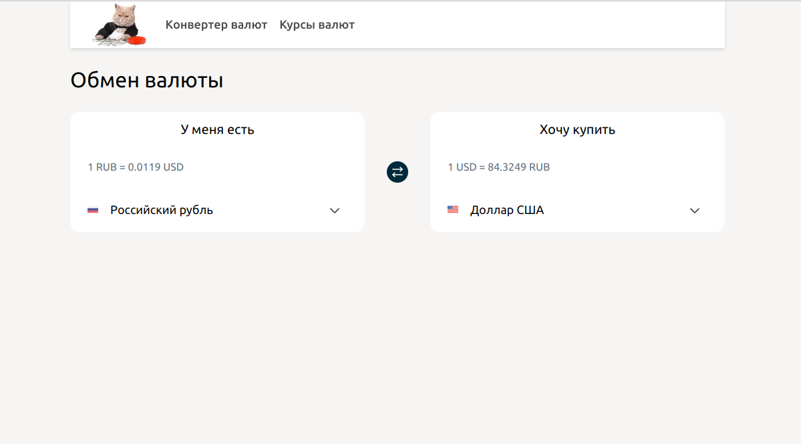
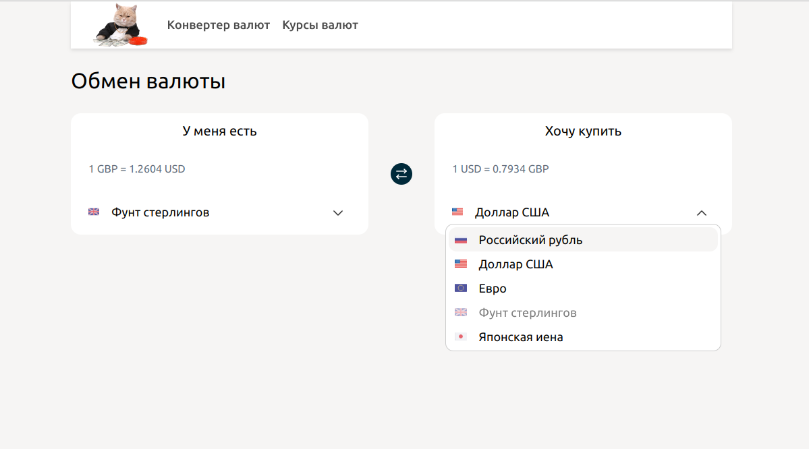
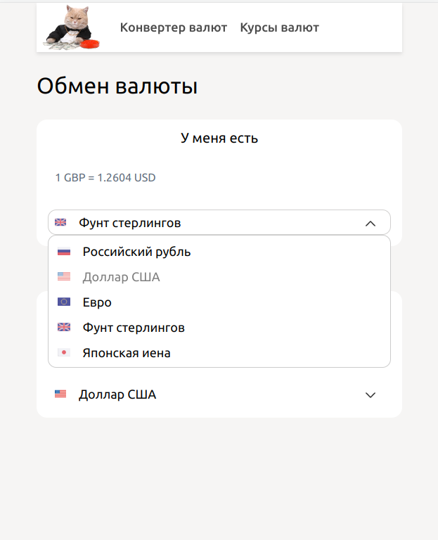

##### Запуск проекта

```
npm install
```

```
npm run start
```

Коневертер валют на ванильном JS. Интерфейс и функционал отчасти скопирован с https://www.sravni.ru/

Курсы валют к рублю подтягиваются скриптом с сайта ЦБ сторонним скриптом, относительно него пересчитываются курсы остальных валютных пар.

Реализованы кастомный инпут и дропдаун.

---

### Скриншоты






